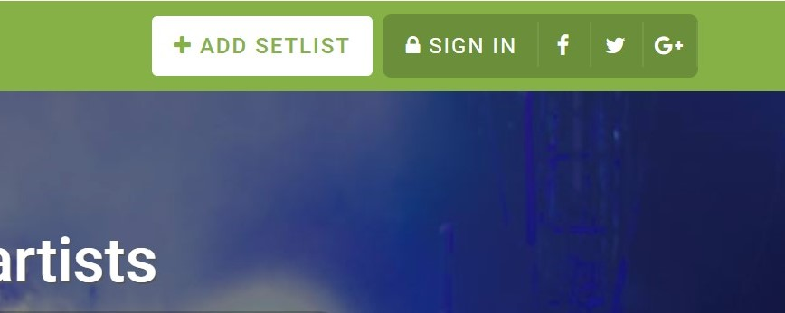
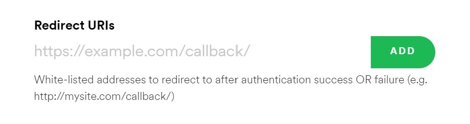

# Live Playlist

<!--  -->

This is a script written in Python3 that grabs concert setlists for a specified
band and creates a Spotify playlist for the given concert.

## How It Works

This repo consists of an API wrapper for setlist.fm and an API wrapper for
Spotify. There is a third script that manages user input and passes it to these
two classes. To run this script, clone the repo to a local machine, follow the
deployment guide, and run

```bash
python3 /path/to/playlist_gen.py
```

Follow the on-screen instructions. You will need to open a Spotify link to
authorize playlist access. Once you grant permission, you will be redirected
based on the redirect URI you provided. Copy and paste the link to which
you were redirected, and proceed with choosing a setlist.

Once the playlist is created, you will be given a link to go there, or you can
find the playlist in your library.

**Note:** _There is no functionality for user input at the moment. This will be implemented within the next week. For current testing, change the variables located in the main function in playlist_gen.py_

## Dependencies

This program requires the following python libraries:

- requests
- json
- operator
- base64
- datetime
- time
- urllib
  
## Why Not Use Spotipy?

Spotipy is great, but I had not yet come across the library until I had already
implemented the Spotify API wrapper, so I'm sticking with my own for now since
this is just a terminal app at the moment, and Spotipy has more functionality
than I need. If I decide to expand it to web use, I will likely make the switch.

## Deploying Your Own

We store our API keys for this project in a `config.json` file. If you want to
run this project on your local machine, you need a free
API token from setlist.fm as well as a free API token from Spotify.

For setlist.fm, all you need to do is login or sign up for an account and
request an API key.



For Spotify, you will want to create a new application under the developer page.
Once you have added a new app to your developer account and given ita name and
a description, you will need to click `Edit Settings` and add a redirect URI.
Since this is not a web application, you can just add `https:/localhost/`.



Create a `config.json` file and format it as follows:

```json
{
  "setlist": {
    "api_key": "your-setlist-fm-api-key"
  },
  "spotify": {
    "client_id": "your-spotify-client-id",
    "client_secret": "your-spotify-client-secret",
    "redirect_uri": "your-spotify-redirect-uri"
  }
}
```

## Todo List

- [x] Grab API tokens for Spotify and Setlist.fm
- [x] Write function to grab setlist for an artist with either the date of the
      show or the tour
- [x] Write function to find matches on Spotify or skip the track if it is
      unavailable
- [x] Make playlist with given account and return link to playlist
- [x] Add functionality to prompt user input for playlist generation
- [x] Add functionality between original or remix versions of songs
- [ ] Find more edge cases to fix bugs
- [ ] Figure out a way to find songs that are mislabeled on setlist.fm
- [ ] Come up with a solution to naming livestreams (right now, most
      livestreams are labeled as "Unknown Venue", "Unknown City", etc.)
- [ ] Make a `requirements.txt` to easily manage dependencies

## Known Issues

- Some songs will not be found on Spotify even if they exist. This is due on the song name listed on setlist.fm containing extraneous wording.
  - e.g. "Legend of Zelda" will not show up in Spotify if it is listed as "The Legend of Zelda Theme" on setlist.fm
- If a band has released a set as a "Live Album," then the non-live version of the songs tends to be chosen first. I will look to add the option to choose the live version of songs later down the road.
